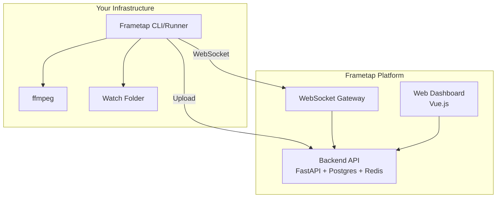
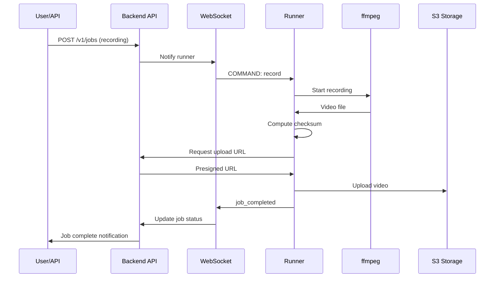
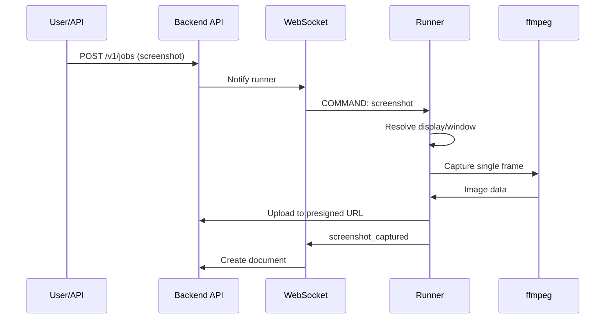
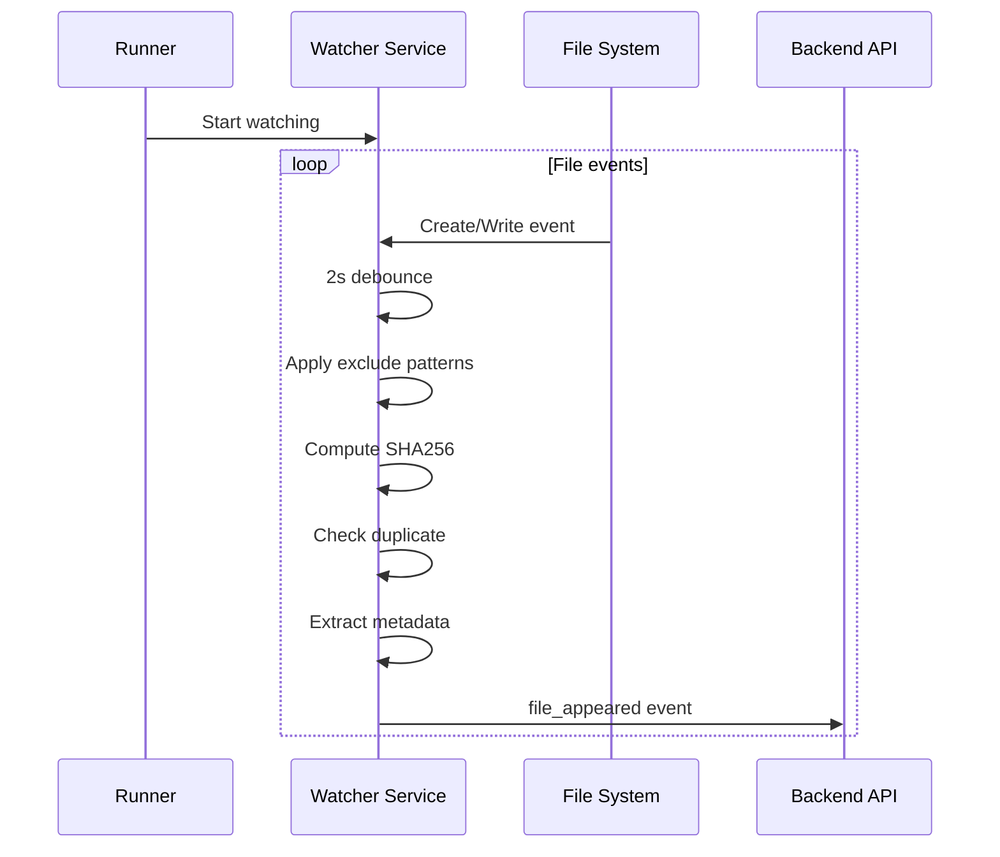

# Architecture

Frametap is built as a distributed system with three main components that work together to provide API-controlled screen capture.

## System Overview



## Components

### CLI Runner (`frametap`)

The Frametap CLI is a Go-based daemon that runs on target machines:

**Location**: Your machines (laptops, servers, containers, VMs)

**Responsibilities**:
- Screen and window discovery
- Screenshot capture via ffmpeg
- Video recording with multiple stop conditions
- Watch folder monitoring
- File upload with presigned URLs
- WebSocket communication with backend

**Architecture**:
```
cmd/cli          - CLI entrypoint (user commands)
cmd/daemon       - Daemon entrypoint (background process)
internal/cli     - Cobra commands, JSON-RPC client
internal/daemon  - JSON-RPC server, WebSocket agent
internal/services/recording    - Video recording
internal/services/screenshot   - Screenshot capture
internal/services/watcher      - File system monitoring
internal/shared/*              - Shared utilities
```

**IPC**: JSON-RPC over UNIX socket
- `status` - version, uptime, runner info
- `screens` - list displays
- `windows` - list windows
- `watch.start` - start watching a directory
- `watch.stop` - stop watching
- `shutdown` - stop daemon

### Backend API

FastAPI service running on Frametap infrastructure:

**Location**: `https://api.frametap.io`

**Responsibilities**:
- Runner registration and authentication
- Job scheduling and management
- Artifact storage and retrieval
- Billing and credit management
- WebSocket coordination

**Layer Architecture**:
```
delivery/    - FastAPI routers, schemas, middleware
application/ - Use case orchestration, permissions
domain/      - Entities, types, business rules
infrastructure/ - Repositories, adapters, DI
```

**Data Stores**:
- PostgreSQL: Primary persistence (users, runners, jobs, documents)
- Redis: Caching and async coordination
- S3: File storage (videos, screenshots, logs)

### Web Dashboard

Vue.js frontend application:

**Location**: `https://frametap.io`

**Responsibilities**:
- Runner management and monitoring
- Job creation and monitoring
- Document viewing (recordings, screenshots, files)
- Real-time status via WebSocket
- Credit management and billing

## Data Flow

### Recording Job Flow



### Screenshot Flow



### Watch Folder Flow



## Security

### Authentication

1. **Enrollment Tokens**: Used to register runners, scoped by capabilities
2. **Runner Tokens**: Short-lived tokens for WebSocket authentication
3. **API Keys**: For programmatic API access
4. **Session Cookies**: For web dashboard authentication (WorkOS)

### Data Protection

- TLS 1.3 for all API and WebSocket connections
- Presigned URLs for file uploads (time-limited, one-time use)
- SHA256 checksums for file integrity
- Files encrypted at rest in S3

## Scalability

- Runners are stateless and can be deployed at scale
- Backend uses horizontal scaling with load balancing
- Redis for distributed coordination
- PostgreSQL for transactional consistency

## Deployment Options

### Local Machine
```bash
frametap up --token <token>
```

### Docker Container
```yaml
services:
  frametap:
    image: frametap/frametap-cli:latest
    environment:
      - FRAMETAP_TOKEN=<token>
      - FRAMETAP_AUTO_RECORD=true
```

### Kubernetes
Run as a sidecar container in your pod, or as a DaemonSet for node-level capture.

### CI/CD Pipelines
Enroll runners as part of your pipeline jobs, auto-recording test sessions.
