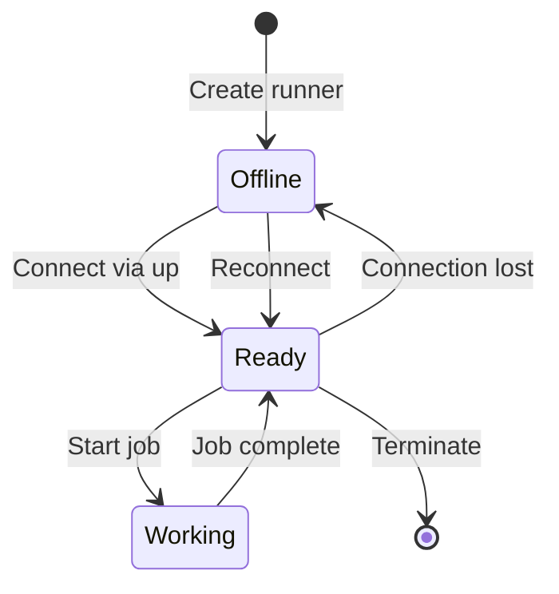

# Runners

Runners are agents that run on your machines to perform screen captures and file uploads.

## Overview

A runner is a process (the Frametap CLI daemon) that:
- Maintains a WebSocket connection to the Frametap backend
- Receives commands to capture screens, record video, or upload files
- Executes captures using ffmpeg
- Uploads results to the Frametap platform

## Runner Lifecycle



## Runner Status

- **`offline`** - Not connected to backend
- **`ready`** - Connected and waiting for jobs
- **`working`** - Currently executing a job

## Registration

### Via CLI

```bash
frametap up --token ft_enrollment_xxxxxxxxxxxxxxxxx
```

### Via API

```bash
curl -X POST https://api.frametap.io/v1/runners/register \
  -H "Content-Type: application/json" \
  -d '{
    "token": "ft_enrollment_xxxxxxxxxxxxxxxxx",
    "hostname": "production-runner-1",
    "labels": {
      "environment": "production",
      "region": "us-east"
    }
  }'
```

**Response:**
```json
{
  "success": true,
  "data": {
    "runnerId": 123,
    "runnerToken": "ft_runner_xxxxxxxxxxxx",
    "organizationId": 456
  }
}
```

::: warning
Store the `runnerToken` securely. It's used for WebSocket authentication.
:::

## Capabilities

Runners can have different capabilities based on the enrollment key:

- **`record`** - Can capture screen recordings
- **`screenshot`** - Can capture screenshots
- **`upload`** - Can upload files from watch folders
- **`stream`** - Can stream live video

Check capabilities:

```bash
frametap status
```

## Managing Runners

### List Runners

```bash
# Via CLI
frametap status  # Shows current runner

# Via API
curl https://api.frametap.io/v1/runners \
  -H "Authorization: Bearer $API_KEY"
```

### Update Runner

```bash
# Change name
curl -X PATCH https://api.frametap.io/v1/runners/123 \
  -H "Authorization: Bearer $API_KEY" \
  -d '{"name": "renamed-runner"}'
```

### Terminate Runner

```bash
# Graceful termination
curl -X DELETE https://api.frametap.io/v1/runners/123 \
  -H "Authorization: Bearer $API_KEY"
```

Or via CLI:
```bash
frametap down
```

## Runner Data

The runner stores data locally:

### Linux
- Config: `~/.config/frametap/`
- Data: `~/.local/share/frametap/`

### macOS
- Config: `~/Library/Application Support/frametap/`
- Data: `~/Library/Application Support/frametap/`

### Key Files

- `runner.json` - Registration data (runnerId, token)
- `watcher.json` - Watch folder configuration
- `checksums.json` - Deduplication database

## Runner Metadata

Runners automatically report:

```json
{
  "version": "1.0.0",
  "platform": "linux/amd64",
  "hostname": "my-server",
  "runtime": "docker",
  "displays": [
    {
      "id": ":0",
      "width": 1920,
      "height": 1080
    }
  ]
}
```

Update displays:

```bash
curl -X PATCH https://api.frametap.io/v1/runners/123/displays \
  -H "Authorization: Bearer $API_KEY" \
  -d '{
    "displays": [
      {"id": ":0", "name": "Primary", "width": 1920, "height": 1080}
    ]
  }'
```

## Runner Health

The runner sends heartbeats every 30 seconds. If the backend doesn't receive a heartbeat for 2 minutes, the runner is marked as `offline`.

## Multi-Runner Setup

Run multiple runners on the same machine with different names:

```bash
# Runner 1 - CI/CD
FRAMETAP_HOSTNAME=ci-runner-1 frametap up --token $TOKEN1

# Runner 2 - Development
FRAMETAP_HOSTNAME=dev-runner-1 frametap up --token $TOKEN2
```

## Troubleshooting

### Runner shows offline
- Check network connectivity
- Verify token hasn't expired
- Check firewall rules for WebSocket (wss://)

### Cannot register runner
- Verify enrollment token is valid
- Check token hasn't been revoked
- Ensure token has correct scopes

### Jobs not executing
- Verify runner status is `ready`
- Check runner has required capabilities
- Review runner logs for errors
